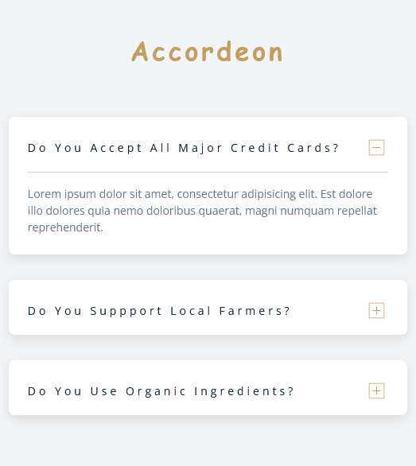

# Portfolio

- CV: https://viktishchenko.github.io/simple-cv/markdown-cv/
- Portfolio: https://viktishchenko.github.io/simple-cv/html-cv/

## app1: test (React)

<table>
<tr>
    <td>
        <ul>
            <li>The application bla-bla-bla</li>
            <li>in action: https://www.google.com/search?q=bla-bla-bla</li>
            <li>Stack: React, Redux </li>
            <li>11.02.2023</li>
    </td>
    <td width="40%">
        
    </td>
</tr>
</table>
