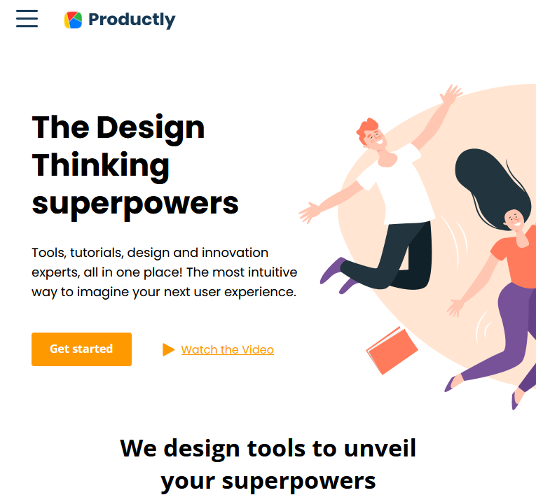
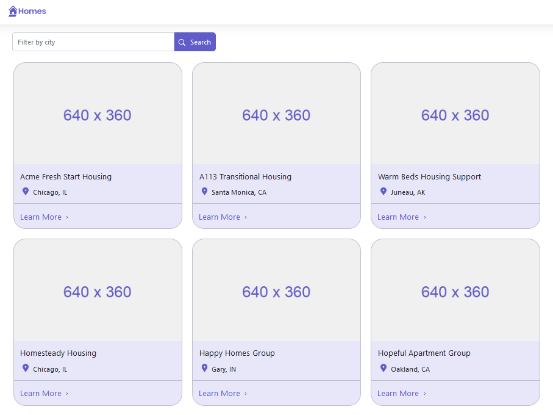

# Portfolio

- CV: https://viktishchenko.github.io/simple-cv/markdown-cv/
- Portfolio: https://viktishchenko.github.io/simple-cv/html-cv/

## Landing page "Productly"

<table>
<tr>
    <td>
        <ul>
            <li>7 in 1 pattern, sass, bem, mixins, placeholders</li>
            <li>adaptive: 1440/768/414/320 px </li>
            <li>js, OOP/functional, webpack</li>
            <li>in action: https://viktishchenko.github.io/tasks/productly/</li>
            <li>repo: https://github.com/viktishchenko/tasks/tree/productly</li>
    </td>
    <td width="40%">
        
    </td>
</tr>
</table>

## "Momentum"

<table>
<tr>
    <td>
        <ul>
            <li>DOM, localStorage, date/time, async/await, fetch</li>
            <li>responsive</li>
            <li>in action: https://viktishchenko.github.io/tasks/momentum/</li>
    </td>
    <td width="40%">
        
    </td>
</tr>
</table>

## "Photo-filter"

<table>
<tr>
    <td>
        <ul>
            <li>DOM, input/output, events, date/time, e.matches()</li>
            <li>adaptive(basic)</li>
            <li>in action: https://viktishchenko.github.io/tasks/photo-filter/</li>
    </td>
    <td width="40%">
        
    </td>
</tr>
</table>

## "Calculator"

<table>
<tr>
    <td>
        <ul>
            <li>js, DOM, input/output, events, Math</li>
            <li>adaptive(basic)</li>
            <li>in action: https://viktishchenko.github.io/tasks/calculator/</li>
    </td>
    <td width="40%">
        
    </td>
</tr>
</table>

## "Tours" (react)

<table>
<tr>
    <td>
        <ul>
            <li>hooks, fetch, components</li>
            <li>repo: https://github.com/viktishchenko/rehearsal/tree/master/projects/src/draft/02-tours</li>
            <li>in action: https://viktishchenko.github.io/start-react/tours/</li>
    </td>
    <td width="40%">
        
    </td>
</tr>
</table>

## "Tabs"

<table>
<tr>
    <td>
        <ul>
            <li>js, data</li>
            <li>repo: https://github.com/viktishchenko/js-projects/tree/gh-pages/tabs</li>
            <li>in action: https://viktishchenko.github.io/js-projects/tabs/tabs/</li>
    </td>
    <td width="40%">
        
    </td>
</tr>
</table>

## "Toduos" (react)

<table>
<tr>
    <td>
        <ul>
            <li>hooks, components, alerts, localStorage</li>
            <li>repo: https://github.com/viktishchenko/rehearsal/tree/master/projects/src/draft/10-bud</li>
            <li>in action: https://viktishchenko.github.io/start-react/grocery/</li>
    </td>
    <td width="40%">
        
    </td>
</tr>
</table>

## "Basket" (react)

<table>
<tr>
    <td>
        <ul>
            <li>hooks, components, alerts, localStorage</li>
            <li>repo: https://github.com/viktishchenko/rehearsal/tree/master/projects/src/draft/14-cart</li>
            <li>in action: https://viktishchenko.github.io/start-react/cart/</li>
    </td>
    <td width="40%">
        
    </td>
</tr>
</table>

## "Cocktail" (react)

<table>
<tr>
    <td>
        <ul>
            <li>hooks, components, fetch, router, context</li>
            <li>repo: https://github.com/viktishchenko/rehearsal/tree/master/projects/src/draft/15-cockt</li>
            <li>in action: https://viktishchenko-cocktail-app.netlify.app/</li>
    </td>
    <td width="40%">
        
    </td>
</tr>
</table>

## "Quiz" (react)

<table>
<tr>
    <td>
        <ul>
            <li>hooks, components, modal, fetch, context</li>
            <li>repo: https://github.com/viktishchenko/rehearsal/tree/master/projects/src/draft/23-quiz</li>
            <li>in action: https://viktishchenko.github.io/start-react/quiz/</li>
    </td>
    <td width="40%">
        
    </td>
</tr>
</table>

## "Pure CSS slider"

<table>
<tr>
    <td>
        <ul>
            <li>css</li>
            <li>repo: https://github.com/viktishchenko/cssMemSlider/tree/gh-pages/cssMemSlider</li>
            <li>in action: https://viktishchenko.github.io/cssMemSlider/cssMemSlider/</li>
    </td>
    <td width="40%">
        
    </td>
</tr>
</table>

## "React"

<table>
<tr>
    <td>
        <ul>
            <li>styled-components, Redux Toolkit, Node, MySQL</li>
            <li>repo: https://github.com/viktishchenko/rehearsal</li>
            <li>in action: it's coming</li>
    </td>
    <td width="40%">
        
    </td>
</tr>
</table>

## "Node"

<table>
<tr>
    <td>
        <ul>
            <li>repo: https://github.com/viktishchenko/HTML-builder-und-berries</li>
            <li>in action: coming soon</li>
    </td>
    <td width="40%">
        
    </td>
</tr>
</table>

## "MySQL"

<table>
<tr>
    <td>
        <ul>
            <li>repo: https://github.com/viktishchenko/MySQL-CRUD2</li>
            <li>in action: it's coming</li>
    </td>
    <td width="40%">
        
    </td>
</tr>
</table>

## "Angular CRUD"

<table>
<tr>
    <td>
        <ul>
            <li>CRUD app without backend(localstorage)</li>
            <li>angular, typescript и rxjs</li>
            <li>repo: https://github.com/viktishchenko/ang-test/tree/withoutApi</li>
            <li>in action: https://tranquil-concha-f6e106.netlify.app/</li>
    </td>
    <td width="40%">
        
    </td>
</tr>
</table>

## "basic Angular app with routing"

<table>
<tr>
    <td>
        <ul>
            <li>front</li>
            <li>angular, angular material ui, rxjs</li>
            <li>repo: https://github.com/viktishchenko/ang-test/tree/front-shop</li>
            <li>in action: https://sprightly-fudge-2435b5.netlify.app/</li>
    </td>
    <td width="40%">
        
    </td>
</tr>
</table>

## "Angular, bootstrap app "

<table>
<tr>
    <td>
        <ul>
            <li>front</li>
            <li>angular, bootstrap, rxjs</li>
            <li>repo: https://github.com/viktishchenko/ang-test/tree/city-app</li>
            <li>in action: https://iridescent-kangaroo-076368.netlify.app/</li>
    </td>
    <td width="40%">
        
    </td>
</tr>
</table>

## "Angular, material CRUD"

<table>
<tr>
    <td>
        <ul>
            <li>front</li>
            <li>angular, material, rxjs</li>
            <li>repo: https://github.com/viktishchenko/ang-test/tree/heroes</li>
            <li>in action: https://roaring-caramel-b97a20.netlify.app/</li>
    </td>
    <td width="40%">
        
    </td>
</tr>
</table>

## "Angular, template-driven form"

<table>
<tr>
    <td>
        <ul>
            <li>angular, bootstrap, template-driven form</li>
            <li>repo: https://github.com/viktishchenko/ang-test/tree/tpd-form</li>
            <li>in action: https://resilient-cendol-a4a9b8.netlify.app/</li>
    </td>
    <td width="40%">
        
    </td>
</tr>
</table>

## "Angular and Scully blog app"

<table>
<tr>
    <td>
        <ul>
            <li>Angular, Scully, Bootstrap</li>
            <li>repo: https://github.com/viktishchenko/book-prj/tree/master/ch2</li>
            <li>in action: https://creative-gumption-71ec70.netlify.app/</li>
    </td>
    <td width="40%">
        
    </td>
</tr>
</table>

## "Angular, Clarity, reactive form app"

<table>
<tr>
    <td>
        <ul>
            <li>Angular, Clarity, reactive form</li>
            <li>repo: https://github.com/viktishchenko/book-prj/tree/master/ch3</li>
            <li>in action: https://classy-kashata-87cb13.netlify.app/</li>
    </td>
    <td width="40%">
        
    </td>
</tr>
</table>

## "Angular Universal SSR app with RxJs and Bootstrap 5"

<table>
<tr>
    <td>
        <ul>
            <li>Angular, Bootstrap, RxJs</li>
            <li>repo: https://github.com/viktishchenko/book-prj/tree/master/ch7</li>
            <li>in action: https://dapper-gnome-910dcb.netlify.app/</li>
    </td>
    <td width="40%">
        
    </td>
</tr>
</table>

## "Angular-app with RxJs and Bootstrap"

<table>
<tr>
    <td>
        <ul>
            <li>Angular, standalone, Bootstrap, RxJs</li>
            <li>repo: https://github.com/viktishchenko/ang-basics/tree/test1</li>
            <li>in action: https://jocular-flan-048d76.netlify.app/</li>
    </td>
    <td width="40%">
        
    </td>
</tr>
</table>
